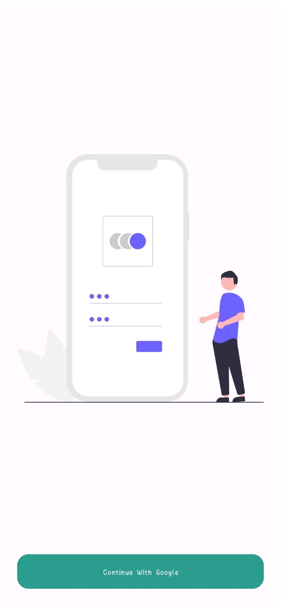
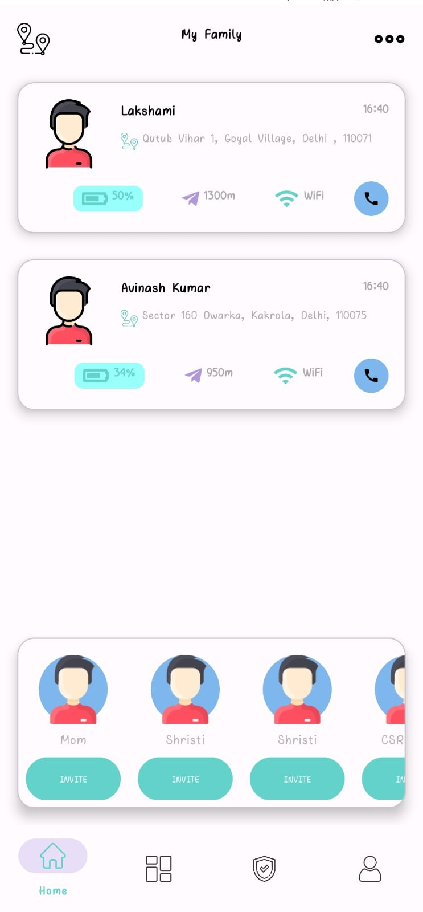
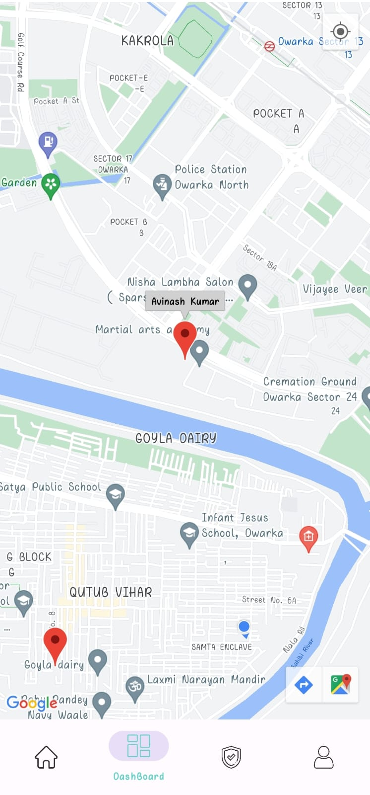
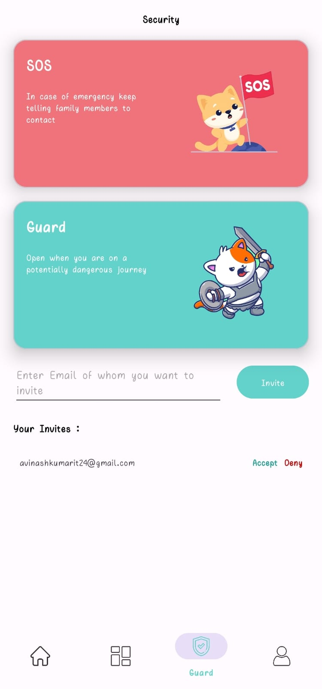
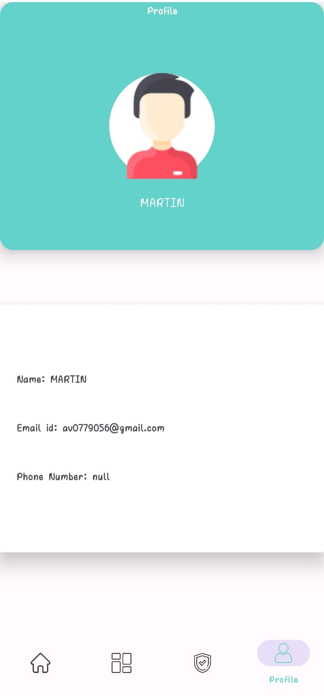

# Family_Safety

In an ever-changing world, the safety and well-being of our loved ones remain a top priority. We understand the challenges families face in staying connected, tracking each other's locations, and responding to emergencies. That's why we've developed "FamilyGuard," a comprehensive family security app that simplifies and enhances your family's safety. With real-time location tracking, secure communication, and seamless integration, FamilyGuard offers you the peace of mind you've been looking for. Join us today as we unveil a new era of family security.

# Key Features:-

1. **Real-Time Location Tracking:** Keep a watchful eye on the whereabouts of your family members in real-time, ensuring you're always connected.

2. **Dashboard with Live Map:** Visualize your family's positions on a dynamic map, providing a quick overview of their locations at a glance.

3. **User Profiles:** Personalize user profiles with essential information, facilitating easy communication within the family network.

4. **Guard Section:** Two critical safety features at your fingertips:

    a) **Secure:** Let your loved ones know you've arrived safely with a single tap. 
    b) **SOS:** In emergencies, instantly send an SOS message to alert family members.

5. **Home Page with Member List:** Access all the family members you've added in one convenient place, simplifying communication and monitoring.

6. **Invite Contacts:** Expand your family network by inviting friends or additional contacts to join your secure circle.

7. **Firebase Integration:** Leverage the power of Google Firebase for secure authentication, cloud storage, and real-time synchronization.

8. **Room Database:** Efficiently manage local data, ensuring seamless user experiences even when offline.

9. **Coroutines:** Swiftly and efficiently handle background tasks and asynchronous processes.

10. **Google Maps API:** Seamlessly integrate Google Maps for a user-friendly, location-centric experience.

11. **View Bindings and Data Bindings:** Enhance usability and maintain a smooth user interface with streamlined UI interactions.

12. **Secure and Encrypted:** Prioritize user data security with encryption for data transmission and storage.

# Screen Shots
## Login Page 

## Home Fragment

## DashBoard Fragment

## Guard Fragment

## Profile fragment

 

##  Basic outline for a few key components of app:

**1. User Interface Components:**
   - Detail the layout and interaction for each screen and fragment, including the specific UI elements used (buttons, lists, maps, etc.).
   - Describe the user flows and transitions between screens.

**2. Data Management:**
   - Provide an in-depth schema for the database structure, including tables, fields, and relationships.
   - Explain how data is stored and retrieved using Room Database and Firebase Firestore.
   - Document the data models and their relationships.

**3. Real-Time Location Tracking:**
   - Describe the mechanism for real-time location tracking.
   - Detail how location data is acquired, transmitted, and displayed.
   
**4. User Authentication and Security:**
   - Explain the authentication process using Firebase Authentication.
   - Document how user data is secured during transmission and storage through encryption.

**5. Concurrency and Background Processing:**
   - Describe the use of Kotlin Coroutines to manage asynchronous tasks.
   - Provide specific examples of how Coroutines are used in the app.

**6. Maps and Location Services:**
   - Detail the integration of Google Maps and location services.
   - Explain how the app retrieves and updates location data.

**7. View and Data Bindings:**
   - Illustrate how View Bindings and Data Bindings are used to connect UI components with data sources.
   - Provide code examples demonstrating their implementation.

**8. Navigation:**
   - Explain the navigation structure within your app.
   - Describe how users move between different fragments and screens.

**9. Error Handling and Edge Cases:**
   - Document how the app handles various error scenarios and edge cases, such as network disruptions or unexpected user inputs.

**10. Testing and Debugging:**
   - Detail your testing approach, including unit testing and UI testing.
   - Provide examples of test cases and how they are executed.
